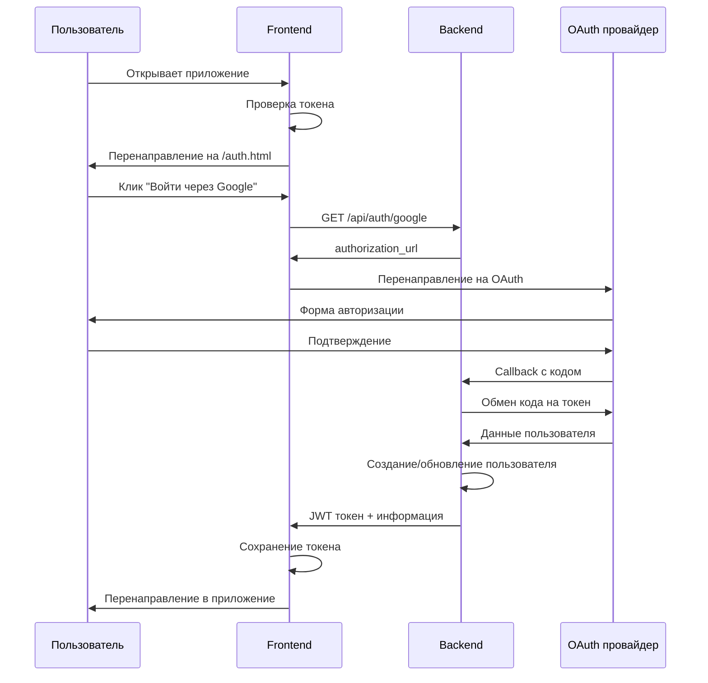

# 🔐 Настройка авторизации через OAuth

Данная инструкция поможет настроить авторизацию через Google и Яндекс для Task Manager.

## 📋 Что реализовано

✅ **OAuth авторизация** через Google и Яндекс  
✅ **Уникальные ссылки** на доски с контролем доступа  
✅ **Читаемое логирование** действий пользователей в файл  
✅ **Блокировка индексации** поисковыми ботами  
✅ **Защищённые API endpoints** с проверкой авторизации  

---

## 🚀 Быстрый старт

### 1. Создайте файл `.env`

```bash
cd backend
cp .env.example .env
```

Отредактируйте `.env`:

```env
# Режим работы
DEBUG=True

# JWT секретный ключ (ОБЯЗАТЕЛЬНО изменить!)
SECRET_KEY=your-super-secret-key-change-in-production

# Google OAuth (получить на https://console.developers.google.com/)
GOOGLE_CLIENT_ID=your-google-client-id
GOOGLE_CLIENT_SECRET=your-google-client-secret
GOOGLE_REDIRECT_URI=http://localhost:8000/api/auth/google/callback

# Yandex OAuth (получить на https://oauth.yandex.ru/)
YANDEX_CLIENT_ID=your-yandex-client-id
YANDEX_CLIENT_SECRET=your-yandex-client-secret
YANDEX_REDIRECT_URI=http://localhost:8000/api/auth/yandex/callback
```

### 2. Пересоздайте базу данных

```bash
# Удалите старую базу (будут потеряны данные!)
rm task_manager_debug.db

# Запустите сервер для создания новой схемы
source venv/bin/activate
uvicorn app.main:app --reload
```

### 3. Запустите приложения

**Backend:**
```bash
cd backend
source venv/bin/activate
uvicorn app.main:app --reload
```

**Frontend:**
```bash
cd frontend
python -m http.server 8080
```

### 4. Откройте приложение

Перейдите на `http://localhost:8080` - вас перенаправит на страницу авторизации.

---

## 🔧 Настройка OAuth провайдеров

### Google OAuth 2.0

1. Перейдите в [Google Cloud Console](https://console.cloud.google.com/)
2. Создайте новый проект или выберите существующий
3. Включите Google+ API
4. Перейдите в "Credentials" → "Create Credentials" → "OAuth 2.0 Client ID"
5. Настройте:
   - **Application type**: Web application
   - **Authorized redirect URIs**: `http://localhost:8000/api/auth/google/callback`
   - Для продакшена добавьте: `https://yourdomain.com/api/auth/google/callback`

### Yandex OAuth

1. Перейдите на [Яндекс.OAuth](https://oauth.yandex.ru/)
2. Нажмите "Зарегистрировать приложение"
3. Заполните форму:
   - **Название**: Task Manager
   - **Права**: `login:email`, `login:info`
   - **Callback URL**: `http://localhost:8000/api/auth/yandex/callback`
   - Для продакшена: `https://yourdomain.com/api/auth/yandex/callback`

---

## 🎯 Как это работает

### 1. Процесс авторизации



### 2. Доступ к доскам

- **Владелец доски**: полный доступ + управление
- **По ссылке**: доступ только для просмотра и редактирования
- **Уникальная ссылка**: вида `/board/550e8400-e29b-41d4-a716-446655440000`

### 3. Логирование действий

Все действия пользователей записываются в файл `logs/user_activity.log`:

```
[2024-01-15 14:30:15] Иван Петров (ivan@example.com) в доске #1 - создал задачу: 'Реализовать авторизацию' (iOS: 3, Android: 2, QA: 1, SA: 1) [IP: 192.168.1.100]
[2024-01-15 14:32:45] Иван Петров (ivan@example.com) в доске #1 - переместил задачу: 'Реализовать авторизацию' (из спринта 1 в спринт 2) [IP: 192.168.1.100]
```

---

## 📚 API Endpoints

### Авторизация

```http
GET  /api/auth/google           # Получить URL для авторизации
GET  /api/auth/google/callback  # Обработка callback
GET  /api/auth/yandex           # Получить URL для авторизации  
GET  /api/auth/yandex/callback  # Обработка callback
GET  /api/auth/me               # Информация о пользователе
POST /api/auth/logout           # Выход (клиентский)
```

### Доски с авторизацией

```http
GET  /api/boards/                    # Мои доски
POST /api/boards/                    # Создать доску
GET  /api/boards/link/{unique_link}  # Доска по ссылке
GET  /api/boards/{id}/share-link     # Получить ссылку (владелец)
POST /api/boards/{id}/regenerate-link # Новая ссылка (владелец)
```

---

## 🔒 Безопасность

### Реализованные меры

1. **JWT токены** с истечением срока (7 дней)
2. **Проверка доступа** на уровне API
3. **Уникальные ссылки** вместо публичных ID
4. **Логирование** всех действий с IP адресами
5. **CORS настройки** для продакшена
6. **robots.txt** для блокировки индексации

### Важные настройки для продакшена

```env
# Обязательно измените!
SECRET_KEY=very-long-random-string-min-32-chars

# Настройте CORS в main.py
allow_origins=["https://yourdomain.com"]

# Используйте HTTPS для OAuth callbacks
GOOGLE_REDIRECT_URI=https://yourdomain.com/api/auth/google/callback
YANDEX_REDIRECT_URI=https://yourdomain.com/api/auth/yandex/callback
```

---

## 🐛 Частые проблемы

### "Недействительный токен"
- Проверьте правильность CLIENT_ID и CLIENT_SECRET
- Убедитесь, что redirect URI совпадает в настройках OAuth

### "Доска не найдена"
- Пользователь должен быть авторизован
- Проверьте правильность уникальной ссылки

### "CORS ошибки"
- Обновите настройки CORS в `main.py` для вашего домена

### База данных
- При изменении моделей удалите `task_manager_debug.db`
- Все данные будут пересозданы при перезапуске

---

## 📊 Мониторинг

### Логи пользователей
```bash
tail -f logs/user_activity.log
```

### Логи сервера
```bash
# При запуске uvicorn покажет все запросы
uvicorn app.main:app --reload --log-level debug
```

### Проверка авторизации
```bash
curl -H "Authorization: Bearer YOUR_TOKEN" http://localhost:8000/api/auth/me
```

---

## 🎉 Готово!

Task Manager теперь защищён авторизацией. Пользователи могут:

- ✅ Авторизоваться через Google или Яндекс
- ✅ Создавать личные доски
- ✅ Делиться досками по уникальным ссылкам
- ✅ Работать безопасно с полным логированием

Все действия записываются в лог для отслеживания активности.
